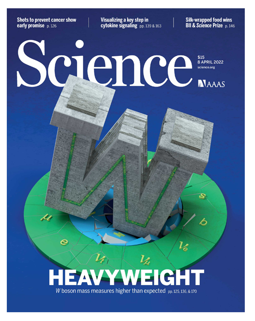
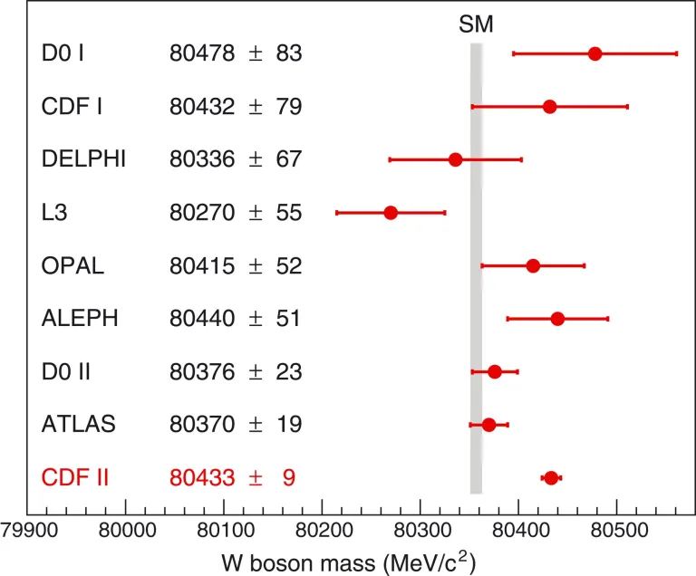
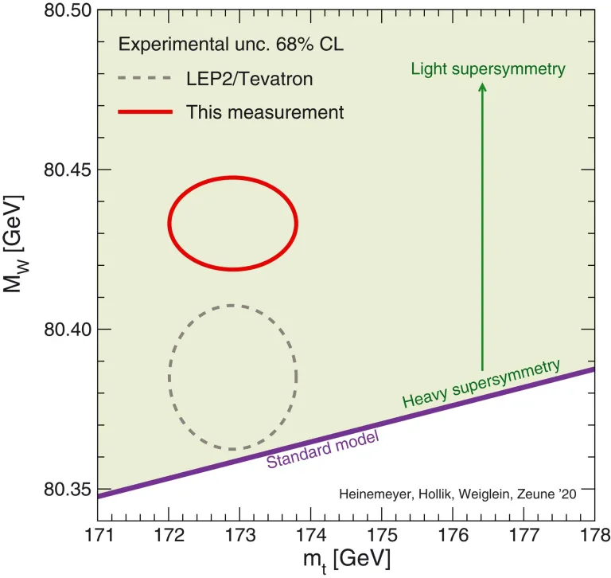

# Has W Boson destroyed the Standard Model?

The discovery, recently published in the American journal Science, is said to be capable of overturning our current understanding of physics. So let's see what the truth is.

Based on data from the Tevatron, the CDF (Collider Detector at Fermilab) team under Fermilab in the United States says that the weight of the W boson has been measured very accurately. Before delving into the details of the experiment, let's understand what the Standard Model of particle physics is. The Standard Model, the canonical model of particle physics, describes the fundamental particles of the universe. The Standard Model has 6 leptons, 6 quarks, 4 gauge bosons, and one Higgs boson. Everything in the universe around us is made of these fundamental particles. Of these, we thought the Higgs boson was the last puzzle of the Standard Model. The Higgs boson gives mass to the above elementary particles. Science says that the W boson also gets its mass through the Higgs mechanism.

The mass of the W boson is 80.357 +/- 0.004 GeV according to the results of worldwide experiments. This value is consistent with the theoretical prediction of the standard model. The theoretical prediction is between 80.356 GeV and 80.357 GeV. The CDF experiment estimates the mass of the W boson to be 80.4335 +/- 0.0094 GeV. Thus, there is a discrepancy between the theoretical prediction of the standard model and the experimental results of the CDF experiment. This is a summary of the new trending news about calculating the mass of W.

**Why is the CDF experimental value better than the LHC experimental values?**

<figure>
 
 <figcaption>Credit:  CDF Collaboration, T. Aaltonen et al., Science, 20</figcaption>
</figure>
LHC (Large Hadron Collider) experiments have 10 times more collisions per detector than CDF experiments. However, despite the large amount of data, the LHC has greater statistical and systematic uncertainties because we know less about the physics at such high energies. On the other hand, the CDF experiment operates at much lower energies than the LHC, and we have less background data from which to select relevant data. So the CDF experimental results should be very good compared to other existing ones.

**Could the CDF experiment be wrong?**

<figure>
 
 <figcaption>Credit:  CDF Collaboration, T. Aaltonen et al., Science, 20</figcaption>
</figure>
Physics is an experimental science. Physicists can only verify what they can measure with some experimental data. But what if the measurement itself is wrong? In such cases, we seek validation of the measure using another experiment or the same experiment. Using this method we can confirm or reject previous results. So, now we cannot accept or reject the CDF results. The best we can do is wait for another competing experiment to make an accurate measurement of the mass of the W boson, or let the CDF experiment repeat the analysis with more calibrated analytical tools.

**The CDF experiment is a decade-long effort by nearly 400 leading scientists from around the world. The article announcing the results appeared in one of the most prestigious journals available, Science. While this doesn't prove the article is true or not, we can be sure there is more to discover than we know.**

**Reference**

>1. https://www.science.org/doi/10.1126/science.abk1781
>2.  https://bigthink.com/starts-with-a-bang/hole-in-the-standard-model/

[**For the Malayalam version of the above article visit LUCA**](https://luca.co.in/w-boson-and-standard-model/)
